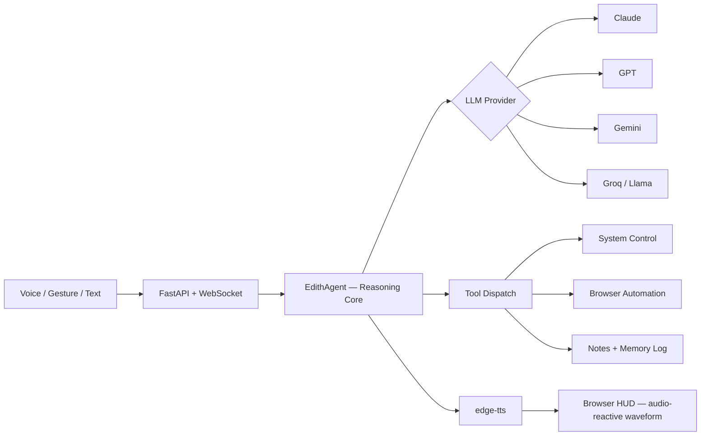

<div align="center">


<br/>


<br/>

</div>

<br/>

EDITH is a locally-hosted personal AI assistant — voice in, voice out, hand gestures, and a swappable LLM brain that can actually reach out and do things: open apps, browse the web, control the system, and remember roughly where you left off last time. The name borrows Tony Stark's AI ("Even Dead, I'm The Hero") as a nod, not a claim. Nothing here is a movie prop — it's FastAPI, WebSockets, and a real tool-calling loop, running entirely on your own machine.

## What It Actually Does

- **Talks and listens.** `faster-whisper` transcribes locally — no cloud STT round-trip — and `edge-tts` speaks the reply back. Hindi and English are both first-class: script is detected automatically and routed to the matching voice.
- **Wakes up on its own.** A standalone wake-word listener starts a turn the moment you say *"EDITH"* — no button required — and shuts down cleanly via `stop_wake_word.bat` without touching unrelated processes.
- **Reads your hands.** MediaPipe hand tracking runs entirely in the browser. Open palm to listen, fist to interrupt, thumbs up to confirm, pinch to adjust volume — no camera frame ever leaves your machine.
- **Controls the machine.** Opens and closes apps, opens websites, runs searches, plays things on YouTube, sets volume/brightness, mutes, reports CPU/RAM/battery/disk, takes screenshots, locks the workstation, and can shut down/restart/sleep — the last of those only after you've explicitly said yes in the conversation.
- **Drives an actual browser.** A separate, persistent, controllable Chromium instance (Playwright) that EDITH can read and act on — click, type, navigate — for anything that needs more than just opening a URL.
- **Remembers.** Live session history feeds the tool-calling loop; a plain-text log on disk lets EDITH recall roughly where the last session left off.
- **Runs on whatever brain you want.** Claude, GPT, Gemini, or Groq's hosted models — swap providers with one line in `.env`, no code changes.

## How It's Wired



Persona, memory, and tool dispatch are identical no matter which provider is answering — `agent/core.py` never sees provider-specific message formats, so adding a fifth brain later is one new class, not a rewrite.

## Choosing a Brain

| Provider | Cost | Default Model | Notes |
|---|---|---|---|
| **Gemini** *(default)* | Free | `gemini-3.6-flash` | Google AI Studio, no card required. Rate-limited. |
| **Groq** | Free | `openai/gpt-oss-120b` | Fast inference on open-weight models, generous free rate limits. |
| **Claude** (Anthropic) | Paid | `claude-sonnet-5` | The most reliable tool-caller of the four. |
| **OpenAI** | Paid | `gpt-5.6` | Flagship reasoning, metered pricing. |

Switch anytime with `LLM_PROVIDER` in `.env`. Check each provider's own console for current pricing and rate limits before committing to one.

## Gesture Legend

| Gesture | Action |
|---|---|
| Open palm | Start listening |
| Fist | Stop / interrupt playback |
| Thumbs up | Confirm |
| Pinch | Adjust volume |

The HUD tracks your hand and reacts live — but the buttons always work too. Gestures are an addition, not a requirement.

## Project Layout

```
EDITH/
├── main.py                 FastAPI server + WebSocket bridge to the UI
├── config.py                All settings, loaded from .env
├── agent/
│   ├── core.py               Reasoning loop — persona, memory, delegates to a provider
│   ├── providers.py          Anthropic, OpenAI, Gemini, and Groq behind one interface
│   ├── persona.py            EDITH's system prompt and operating rules
│   ├── tool_schemas.py       The contract between the brain and the real world
│   ├── tools.py              What the tools actually do on the machine
│   └── browser.py            Controllable browser automation (Playwright)
├── voice/
│   ├── stt.py                  Speech-to-text — faster-whisper, Hindi + English
│   ├── tts.py                   Text-to-speech — edge-tts, auto voice-switching by script
│   └── wake_word.py             Standalone "Hey EDITH" wake-word listener
├── memory/
│   └── store.py                 Live session history + persistent text log
├── frontend/
│   ├── index.html                 HUD shell
│   ├── style.css                   Animated rings, waveform, gesture states
│   └── app.js                        WebSocket client, audio graph, hand tracking
└── stop_wake_word.bat               Clean shutdown for the wake-word process
```

## Getting Started

```powershell
git clone https://github.com/om-nigam34/EDITH.git
cd EDITH

python -m venv venv
venv\Scripts\activate

pip install -r requirements.txt
playwright install chromium

copy .env.example .env
```

Open `.env`, set `LLM_PROVIDER` to the brain you want, and drop your API key into the matching line. Then:

```powershell
python main.py
```

Open `http://127.0.0.1:8765` in Chrome or Edge. Type a command, click the mic, or enable the gesture button. Try: *"what's my battery at,"* *"open notepad,"* *"search for the latest SpaceX launch."*

If `PyAudio` fails to build during install:

```powershell
pip install pipwin
pipwin install pyaudio
```

## Giving EDITH a New Power

1. Write a plain Python function in `agent/tools.py` that does the thing and returns a short result string.
2. Describe it in `TOOLS` inside `agent/tool_schemas.py`.
3. Add one line to `DISPATCH` in `agent/tools.py` mapping the tool name to the function.

Nothing else changes — every provider reads from the same tool list, so a new power is live for all four brains at once.


## Known Limitations

- System-control tools (apps, volume, brightness, power) are Windows-only in this build.
- Browser automation reads a page's interactive elements by index each time — it's general-purpose, not hand-tuned per site, so complex or frequently-changing pages can still trip it up.
- `edge-tts` speaks one voice per reply. Romanized Hinglish comes out in whichever voice is active, phonetically — there's no clean fix for that with a single-voice-per-utterance engine.

## Safety & Privacy

- `power_action` (shutdown/restart/sleep) refuses to run unless the user explicitly confirmed that specific action earlier in the conversation — it's never called speculatively.
- `.env` (your API keys) is git-ignored by default. Never commit it.
- Gesture-control camera frames are processed entirely on-device via MediaPipe in the browser — never sent to the server or the LLM, and the camera only turns on when you enable the gesture button.
- The automated browser uses a persistent local profile so logins survive restarts, same as your regular Chrome profile — it lives only on this machine.
- Conversations are sent to whichever provider you've selected. Check that provider's current data-use policy, especially on free tiers, if that matters to you.


<div align="center">

</div>